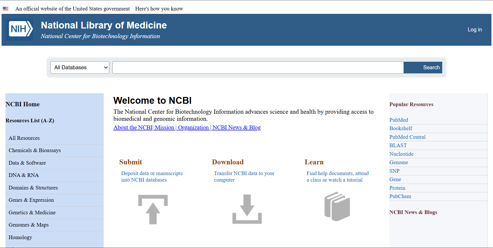

# NCBI Webtool Interface (HTML + CSS)

## Project Overview

This project is a front-end recreation of the **NCBI (National Center for Biotechnology Information)** homepage interface using only **HTML and CSS**.

The goal of this project is to understand web layout design using:

* Semantic HTML tags
* CSS styling
* Flexbox
* Grid system

---

## Features

* Responsive header with NIH logo and login button
* Search bar with dropdown and input field
* Three-column layout (Left Menu | Main Content | Right Panel)
* NCBI-style resource list
* Popular resources section
* Center feature section (Submit, Download, Learn, etc.)
* Clean footer

---

## Technologies Used

* HTML5
* CSS3 (Flexbox & Grid)

---
## Screenshots

---
## 🌐 Live Demo
https://bhat-varsha.github.io/NCBI-access-webtool/
## Key Concepts Learned
---
* Page layout using CSS Grid
* Alignment using Flexbox
* Styling lists and navigation menus
* Organizing project structure
* Linking external CSS files

---

## How to Run

1. Download or clone the repository
2. Open `index.html` in any browser
3. Ensure images folder is in correct path

---

##  Author

**Varsha H G**

---

## Notes

This project is created for academic purposes and is a simplified UI representation of the NCBI website.
